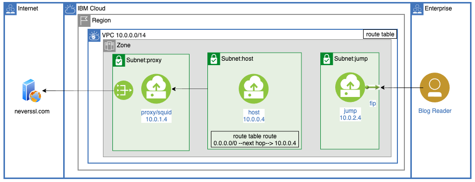

# Virtual Network Functions, VNF, using VPC Routing and Squid

Companion repository to the blog: [Network Function Virtualization (NFV) Using VPC Routing](https://www.ibm.com/cloud/blog/network-function-virtualization-nfv-using-vpc-routing)

VPC Routing allows more control over network flow.  It can be used to support Network Function Virtualization, NFV.  Off the shelf firewall instances like those from Palo Alto and F5,  can be added to a VPC and traffic routes adjusted to insert additional layers of security.


This post will demonstrate a Squid VNF.  Quote from the site:


> Squid is a caching proxy for the Web supporting HTTP, HTTPS, FTP, and more. It reduces bandwidth and improves response times by caching and reusing frequently-requested web pages:




# Steps

- Read the blog [Network Function Virtualization (NFV) Using VPC Routing](https://www.ibm.com/cloud/blog/network-function-virtualization-nfv-using-vpc-routing)

Special IAM permissions:
```
ibmcloud iam user-policy-create YOUR_USER_EMAIL_ADDRESS --roles "IP Spoofing Operator" --service-name is
```

Build and test:
```
cp local.env.template local.env
edit local.env
source local.env
./000-prereq.sh
./010-create.sh
./030-test.sh
./040-cleanup.sh
```
